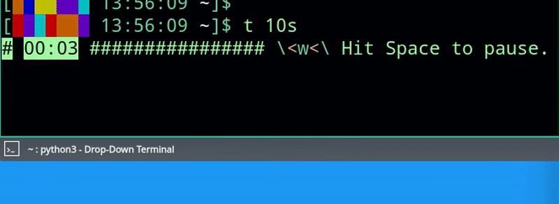

# what
 A Linux terminal timer

```
# Its name is an allusion to the tiger beetle,
# a ferocious predator that runs fast.
# Like time.
```

Cooking, Pomodoro, ... (that's about all I use it for), without picking up the phone or opening a browser tab!


When finished, it plays an alarm sound using aplay (alsa-utils package)...



...and shows a notification using notify-send (libnotify package).


# how
Call it with a time interval: `python timerBeetle.py 15`

By default, numbers are minutes. Format for other time units like days, hours, and seconds:
```
# "23" = 23 minutes
# "23m" = 23 minutes
# "2h" = 2 hours
# "6s" = 6 seconds
# "1d" = 1 day
# "1h 30m" = 1 hour, 30 minutes
# "1d12h30m30s" = 1 day, 12 hours, 30 minutes, 30 seconds
```

I use it with a dropdown terminal (Yakuake, as shown above) that can quickly be rolled back up and not take up permanent screen real estate, and, for brevity, I alias it to the command `t` by putting this line in `~/.bashrc`: `alias t="/the/path/to/timerBeetle.py"`

To customize the alarm sound, replace the file `assets/alarm_sound.wav`.

# license
[Mozilla Public License 2.0](https://mozilla.org/MPL/2.0/)
